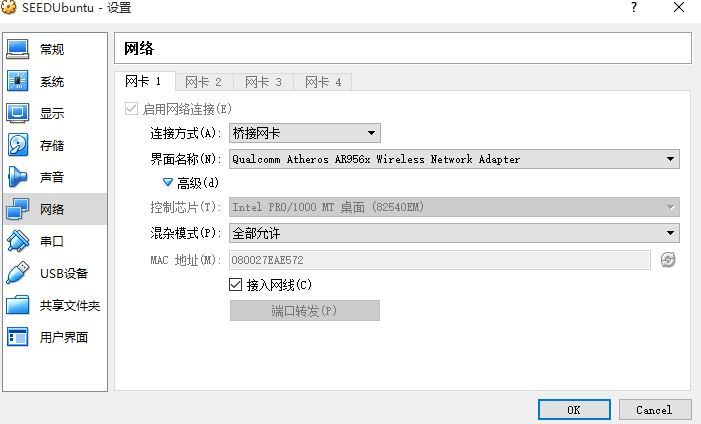
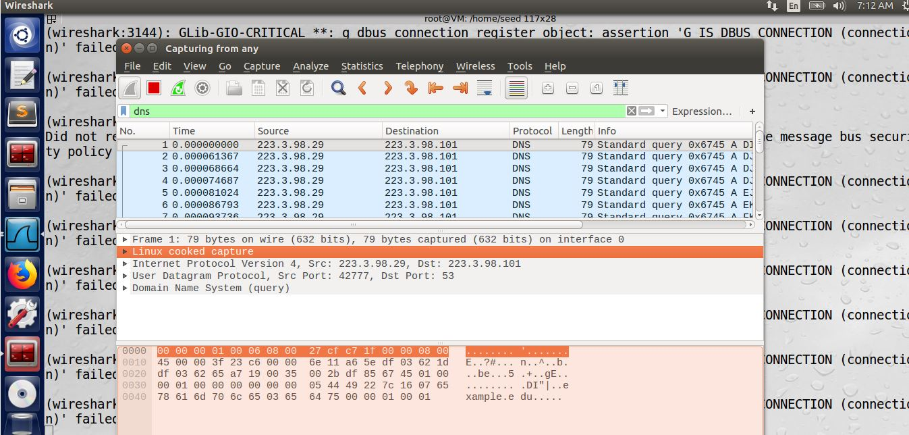

# 一、实验描述
#### DNS（Domain Name System）是一个多层次的分布式数据库系统，其基本功能是完成域名解析，即提供域名和IP 地址之间的映射关系，为Internet 用户提供便利。DNS 服务器只记录本地资源的所有授权主机，若想查询非本地的主机信息，则要向信息持有者（权威DNS 服务器）发送查询请求。为了避免每次查询都发送请求，DNS 服务器会把权威DNS 服务器返回的查询结果保存在缓存中，并保持一定时间，这就构成了DNS 缓存（DNS Cache）。DNS 缓存中毒攻击就是通过污染DNS Cache，用虚假的IP 地址信息替换Cache 中主机记录的真实IP 地 址信息，从而改变域名和IP 的映射关系。这样使得用户在访问某网站时会被错误引导至攻击者的网站中，从而被其获取重要的隐私信息。本实验主要是搭建实验环境，完成远程DNS 缓存中毒攻击实验（Kaminsky 攻击）。
# 二、实验分析
#### 首先，我们的目标是使用户访问目的地址时本地DNS服务器将该域名解析为我们设定的恶意IP。在本地发送访问请求时，恶意DNS服务器将地址重定向到恶意网址。
#### 在实际操作中我们向DNS服务器投毒使得DNS服务器缓存错误。用户在向中毒的DNS服务器发送访问请求是中毒的DNS服务器将返回恶意网址。
### 毒化缓存主要有以下三个约束：
1. TTL约束： 域名不能够已经在dns cache server的缓存中
2. Guess约束：transaction id能够成功匹配。
3. Window Time约束：伪造包要比真正DNS服务器返回包快。(受害者只会对先到达的包做出反应)
# 四、实验步骤
## （一）网络配置
### 使用桥接网卡使得三台虚拟机分别有各自的ip，为了方便可以设置静态ip

## （二）配置本地DNS服务器
#### 用于联系客户端与攻击者 
### 设置DNS服务器查询端口，关闭dnssec-validation服务（用来防止DNS缓存投毒攻击）
## （三）配置客户端 
### 在客户端配置使得本地DNS服务器成为客户端服务器
## （四）配置攻击者 
### 攻击者与客户端相同配置
### 攻击者伪造DNS应答包
## （五）开始攻击 
#### 使用wireshark抓包需用root权限并修改init.lua(将最后一行dofile--注释)
1. 在root权限下，编译udp.c
2. 清空被攻击者缓存
3. 发动攻击的命令,第一个IP是攻击者IP，第二个IP是被攻击者IP。
###### ./udp 192.168.109.140 192.168.109.139
4. DNS服务器收到大量应答包

### 发现此时DNS记录中目的ip已经发生了变化，说明攻击成功

- 具体步骤
1. DNS配置： sudo rndc flush sudo rndc dumpdb -cache sudo nano /etc/bind/named.conf.options //关闭dnssec-validation服务 service bind9 restart //重启DNS服务
2. 客户端配置： sudo nano /etc/resolv.conf //将nameserver改为DNS的IP 禁用DHCP //wired中IPv4 Setting选项卡中Method更改为:Automatic(DHCP) addresses only,DNS servers改为DNS服务器IP
3. 攻击者配置 与客户端配置相同 伪造DNS应答包